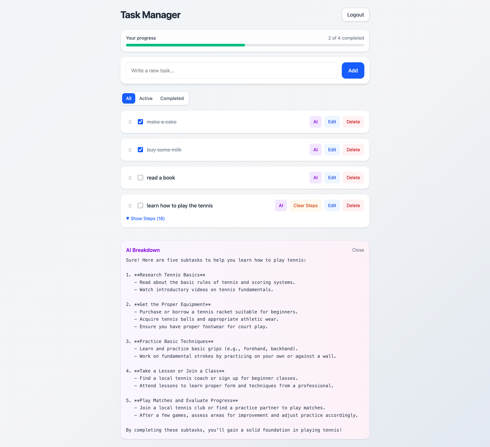
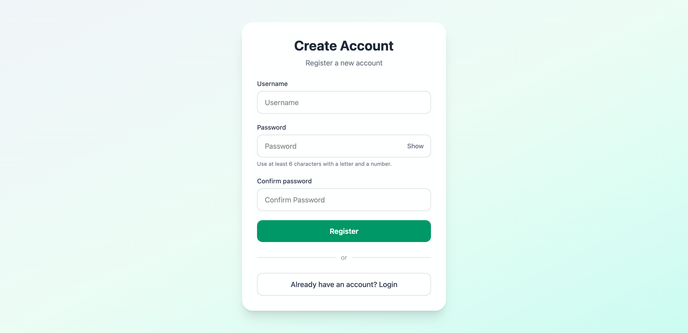

# Smart Task Manager

An AI-powered task management application built with React and Flask.

## Live Demo

Frontend Demo: https://smart-task-manager-33r8.onrender.com

Backend API: https://ai-product-studio-qn6v.onrender.com

## Screenshots

### Dashboard



### Login Page


### Register Page



## Features

- User authentication with JWT
- Create, edit, and delete tasks
- Mark tasks as completed
- Drag-and-drop task reordering
- AI-generated task breakdowns
- Expand/collapse subtasks
- Clear AI-generated steps

## Tech Stack

### Frontend
- React
- React Router
- Tailwind CSS

### Backend
- Flask
- SQLAlchemy
- JWT Authentication

### AI
- OpenAI API

## Installation

### Backend

```bash
cd backend

python -m venv venv

source venv/bin/activate

pip install -r requirements.txt

python app.py
```

### Frontend

```bash
cd frontend

npm install

npm run dev
```
